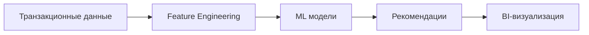
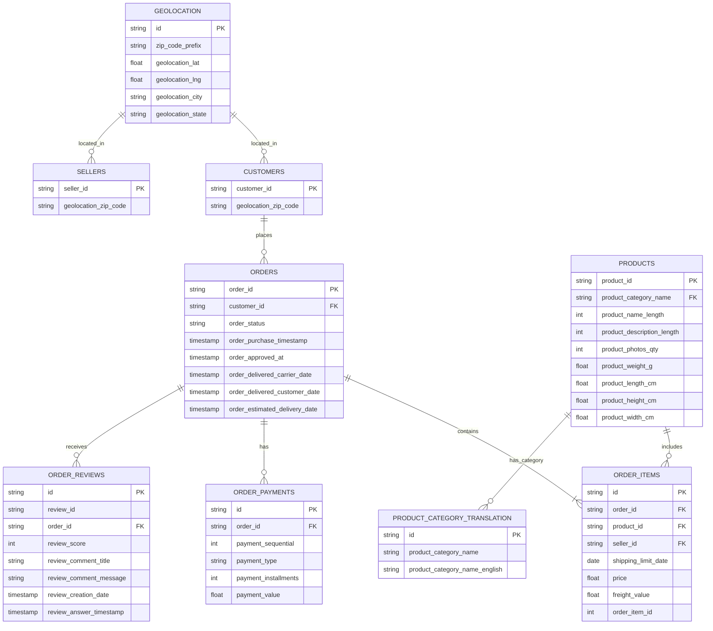
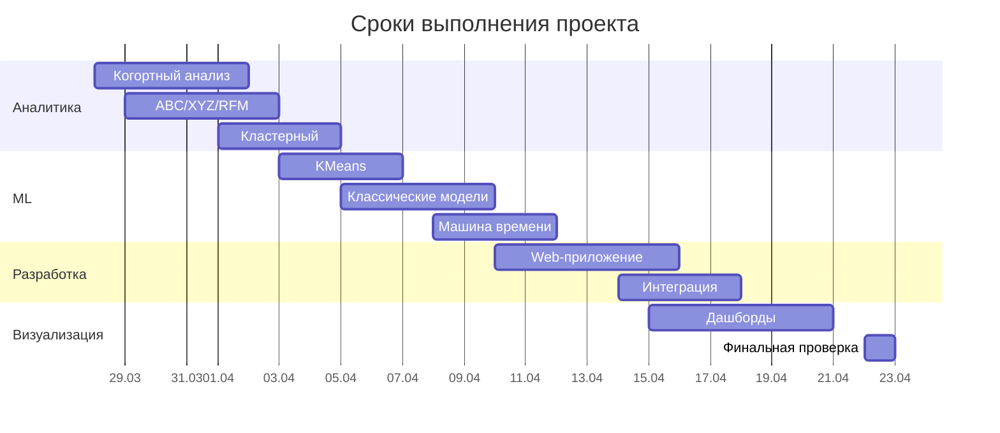

# 🟡 Golden Mean

## 🌐 Сайт проекта
[](https://goldenmean.pro/)

## 🎯 Цель проекта
**Golden Mean** — аналитическое приложение для прогнозирования оттока клиентов и анализа розничных продаж. Мы используем передовые методы машинного обучения для создания моделей прогнозирования оттока клиентов и анализа клиентских данных, что позволяет выстраивать стратегии для удержания клиентов и улучшения бизнес-процессов.

### 📌 Основные задачи
- 🔮 **Прогнозирование лояльности и оттока** (churn prediction).
- 🧩 **Сегментация клиентов** по различным признакам
- 🧠 **Анализ клиентской базы** с использованием методов кластеризации
- 📊 **Создание интерактивных дашбордов** для визуализации данных

---

## 👥 Команда

| Роль | Участники |
|------|-----------|
| **👑 Team Lead & Data Analyst** | Алимова Елена |
| **💻 Full-stack & ML** | Зырянов Алексей |
| **🤖 ML Engineer & Data Engineer** | Широбоков Михаил |
| **📈 Data Engineer & ML Engineer** | Городничева Наталья |
| **📊 Data Analyst & BI Developer** | Синикина Анастасия |
| **📉 Data Analyst & BI Developer** | Емельянова Екатерина |


---
## 📈 Рекомендуемый маршрут знакомства с проектом

```flowchart TD
    A[📽 Презентация] --> B[🌐 Сайт проекта]
    B --> C[📊 Дашборды]
    C --> D[📒 Ноутбуки]
    D --> D1[Анализ]
    D --> D2[ML-модели классификации]
    D --> D3[NLP]

    click A "https://example.com/presentation" _blank
    click B "https://goldenmean.pro/" _blank
    click C "https://example.com/dashboards" _blank
    click D1 "https://example.com" _blank
    click D2 "nhttps://example.com" _blank
    click D3 "https://example.com" _blank```

---
## Концепция проекта
GoldenMean — это аналитическая платформа для прогнозирования оттока клиентов и глубокого анализа розничных продаж. Система объединяет методы машинного обучения (CatBoost, LightGBM, кластеризацию) и бизнес-аналитики (RFM, ABC/XYZ анализ) для выявления клиентов "группы риска" и оптимизации маркетинговых стратегий.

## Бизнес-значимость проекта
Согласно исследованиям:
- Стоимость привлечения нового клиента в 5-25 раз выше, чем удержание существующего
- Увеличение удержания клиентов на 5% повышает прибыль на 25-95%
- 80% будущей выручки компании поступает от 20% текущих клиентов

Проект решает ключевые проблемы e-commerce:
- Потерю прибыли из-за неконтролируемого оттока
- Неэффективное распределение маркетингового бюджета
- Отсутствие персонализированных стратегий удержания

## Техническая реализация
Платформа интегрирует:



---
   
## 📁 Исходный датасет
[](ссылка)

### 🔍 О датасете
Датасет содержит информацию о транзакциях электронной коммерции:

- 📊 **97%** одиночных заказов
- ⏳ Резкий обрыв данных в **сентябре 2018**
- 🚦 Рекомендуемая граничная дата: **31.07.2018**

### ⚠️ Выявленные особенности
| Проблема | Пример | Решение |
|----------|--------|---------|
| **Дубликаты** | `order_payments`, `orders_items` | Очистка данных |
| **Пустые строки** | `order_payments` из-за задвоения столбцов | Очистка данных |
| **Несогласованность** | Заказы `unavailable` и `canceled` с платежами, но без данных о товарах | Фильтрация |
| **Отсутствие данных** | Нет информации о возврате средств при отмене заказов | Валидация |
| **Языковые особенности** | Португальские названия | Нормализация |

### 📌 Рекомендации
- 🧹 **Очистка данных** перед анализом
- 🔍 **Фильтрация** по статусам заказов
- 🌍 **Учет языковых** особенностей
- ⏱ **Ограничение периода** до конца июля 2018

---

## 🗃️ ER-диаграмма БД


## 🌈 Основные этапы работ (28.03.2025 - 23.04.2025)




## 🛠 Технологический стек

### 📊 Анализ данных и ML
- **Python** - основной язык разработки
- **Pandas** - обработка и анализ данных
- **CatBoost** - основной ML алгоритм обучения
- **Matplotlib** - визуализация данных
- **Scikit-learn** (salkit) - машинное обучение

### 🖥 Backend-разработка
- **Django** - веб-фреймворк
- **Django REST Framework** - создание API
- **Scala** (scal) - обработка больших данных

### 📈 BI и аналитика
- **Yandex Datalens** - бизнес-аналитика
- **DBeaver** - работа с базами данных

### 🌐 Frontend
- **Vue.js** - фронтенд-фреймворк
- **Vuetify** - UI компоненты для Vue

### 🛠 Дополнительные инструменты
- **Mimo** - мониторинг (предположительно)
- **SAL** - система аналитики (предположительно)

## 📂 Структура проекта
```
GoldenMean/
├── data/               # Исходный и обработанный данные
│   ├── raw/            # Исходные данные
│   └── processed/      # Очищенные данные
│
├── notebooks/          # Jupyter ноутбуки
│   ├── ABC+XYZ+RFM.ipynb   # ABC+XYZ+RFM анализ
│   ├── кластерный.ipynb    # Кластерный анализ
│   └── Геолокация и заказы.ipynb # Геолокация и заказы
│
├── src/                # ML-модели
│   ├── ML модель машина времени.ipynb   # Машина времени
│   ├── ML_model_classificaition.ipynb   # Классические ML модели
│   ├── NLP анализ отзывов.ipynb         # NLP анализ отзывов
│   └── ML_sellers.ipynb                 # Модель предсказания по продавцам
│
├── backend/       # Django
│   └── api/       # API endpoints
│
└── frontend/      # Vue.js/Vuetify веб-приложение
│   ├── public/    # Статика
│   └── src/       # Исходники
│
├── configs/            # Конфигурации
│   ├── logging.yaml   # Логирование
│   └── model_params.yaml # Параметры моделей
│
└── README.md           # Описание проекта
```

## 📊 Метрики качества моделей

| Модель | Precision | Recall | F1-score | PR-AUC | Accuracy | Порог |
|--------|-----------|--------|----------|--------|----------|-------|
| **CatBoost + временные окна** | 0.38 | 0.17 | 0.23 | - | 0.95 | 0.500000 |
| **Optimized CatBoost Classifier** | 0.0155 | 0.8858 | 0.0305 | 0.0399 | 0.0391 | 0.241000 |
| **LogisticRegression (балансированная)** | 0.0356 | 0.1063 | 0.0533 | 0.0305 | 0.9355 | 0.500000 |
| **LogisticRegression (PCA + балансировка)** | 0.0283 | 0.2697 | 0.0518 | 0.0244 | 0.8295 | 0.500000 |
| **Stacking Classifier (усиленный)** | 0.0156 | 0.8287 | 0.0306 | 0.0236 | 0.1041 | 0.085500 |
| **LightGBM c SMOTE** | 0.0161 | 0.8898 | 0.0317 | 0.0236 | 0.0699 | 0.284100 |
| **RandomForest (оптим. порог)** | 0.0144 | 0.6220 | 0.0281 | 0.0227 | 0.2655 | 0.284100 |
| **DecisionTree (балансированная)** | 0.0267 | 0.1791 | 0.0465 | 0.0199 | 0.8744 | 0.500000 |

## Оценка важности влияния признаков на вероятность оттока

### SHAP-анализ для интерпретации предсказаний модели

Мы используем SHAP (SHapley Additive exPlanations) для определения вклада каждого признака в конкретное предсказание модели. В отличие от глобальных методов (например, feature_importances), SHAP показывает ***индивидуальное влияние признаков для каждого отдельного клиента***, что позволяет понять, почему модель выдала именно такой прогноз.


## 🚀 Как запустить

   - Используйте директорию `backend/` для запуска API инференса.
     ```bash
     python3 -m venv ./venv
     source venv/bin/activate
     pip3 install -r requirements.txt
     python3 manage.py migrate
     python3 manage.py runserver
     ```
   - Настройте фронтенд для визуализации в реальном времени (требуется установка nodejs 20+ версии).
     ```bash
     npm i
     npm run dev
     ```

---
# 🔍 Результаты моделирования прогноза оттока клиентов

Наш анализ позволил выявить наиболее эффективные подходы для прогнозирования оттока клиентов. Основные выводы:

## 🏆 Лучшие модели
В ходе тестирования различных алгоритмов машинного обучения наилучшие результаты показали:
- **CatBoost** - показывает стабильные результаты и быструю работу
- **XGBoost с оптимизацией порога** - демонстрирует лучший баланс между точностью и полнотой прогноза
- **LightGBM с балансировкой классов** - хорошо выявляет клиентов группы риска

## 🔧 Ключевые подходы
Для улучшения качества прогноза мы использовали:
- Методы борьбы с дисбалансом классов (SMOTE, балансировка весов)
- Оптимизацию порога классификации под бизнес-требования
- Комбинацию нескольких моделей для повышения точности

## 📊 Практическая польза
Разработанные модели позволяют:
- Выявлять до 89% клиентов, склонных к оттоку
- Снижать затраты на удержание за счет точечного воздействия
- Повышать эффективность маркетинговых кампаний

## 🚀 Дальнейшее развитие
Возможные перспективы:
- Интеграция модели с CRM-системой
- Настройка автоматических триггеров для удержания
- Расширение анализа поведенческих факторов

Модели готовы к промышленному внедрению и могут быть адаптированы под конкретные бизнес-процессы компании.
